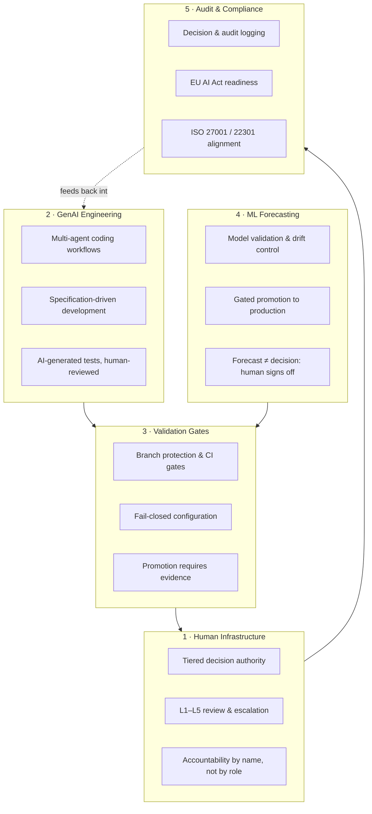

# AI Governance Platform Blueprint

A reference architecture for **AI-governed engineering of mission-critical financial platforms** — where autonomous agents write and test code, machine learning models forecast under strict promotion gates, and humans retain tiered, auditable decision authority over everything that matters.

This blueprint distills patterns from operating a production, AI-native, event-driven platform in a highly sensitive financial domain. It answers one question:

> **How do you let AI move fast inside a system where a mistake has regulatory, financial, and reputational consequences — without ever letting it outrun human accountability?**

---

## ⚠️ Intellectual property notice

**This repository is deliberately sanitized.** Several key product names, vendor and tool choices, proprietary algorithms, source code, infrastructure configurations, thresholds, and data schemas are intentionally withheld or replaced with generic equivalents. What is published here is the *governance architecture* — the principles, controls, decision flows, and organizational patterns — not the product built on top of it. See [DISCLAIMER.md](DISCLAIMER.md).

---

## Who this is for

- **CTOs / VPs of Engineering** introducing AI-assisted development into regulated or mission-critical environments (finance, government, healthcare, critical infrastructure)
- **Platform & SRE leaders** who need CI/CD and observability patterns that treat AI-generated change as a distinct risk class
- **Risk, compliance & audit professionals** mapping engineering controls to EU AI Act, ISO 27001/22301, GDPR, NIST, and DORA-style regulatory expectations
- **Engineering teams** looking for a concrete, opinionated model of human–AI division of labor

---

## The five pillars

| Pillar | Document | Core idea |
|---|---|---|
| Architecture | [docs/architecture-overview.md](docs/architecture-overview.md) | Event-driven microservices, observability, and control planes — anonymized |
| Human authority | [docs/ai-review-escalation-model.md](docs/ai-review-escalation-model.md) | The L1–L5 model: what AI may do alone, what needs a human, what needs *which* human |
| GenAI pipeline | [docs/genai-coding-testing-pipeline.md](docs/genai-coding-testing-pipeline.md) | How AI-written code and tests earn their way into production through validation gates |
| ML governance | [docs/ml-forecasting-governance.md](docs/ml-forecasting-governance.md) | Validation, drift monitoring, gated promotion, and why forecasts never act autonomously |
| Human decisions | [docs/human-decision-support.md](docs/human-decision-support.md) | Decision support design: AI recommends with evidence, humans decide with accountability |
| Fail-closed | [docs/fail-closed-patterns.md](docs/fail-closed-patterns.md) | Missing config, invalid state, uncertain model → stop safely, never guess |
| Compliance | [docs/compliance-mapping.md](docs/compliance-mapping.md) | Mapping engineering controls to EU AI Act, ISO 27001/22301, GDPR, NIST |

Architecture Decision Records: [adr/](adr/) — short, concrete records of the load-bearing decisions.

---

## The one-paragraph version

Autonomous agents propose; validation gates dispose; humans decide. Every AI-generated artifact — code, test, config, model, recommendation — enters the system as an *untrusted proposal*. It earns trust mechanically (schema validation, test suites, security scans, drift checks) and then institutionally (review at the tier matching its blast radius). Nothing reaches production, capital, or customers on AI judgment alone. Every decision — human or machine — is logged with its evidence, so any outcome can be reconstructed, audited, and learned from.

---

## Operating principles

1. **AI accelerates execution; humans retain accountability.** Speed is delegated, responsibility is not.
2. **Every AI artifact is a proposal, not a change.** Proposals are cheap to reject; production incidents are not.
3. **Missing or invalid configuration fails closed.** A system that cannot verify its safety stops, alerts, and waits for a human.
4. **Blast radius determines review tier.** A typo fix and a risk-parameter change are not the same class of decision.
5. **Forecasts inform, humans commit.** A model output is evidence for a decision, never the decision itself.
6. **If it isn't logged, it didn't happen.** Audit evidence is a runtime property, not a quarterly exercise.
7. **Compliance is an architecture concern.** Controls are enforced in code and CI, not described in policy PDFs.

---

## What this blueprint is NOT

- ❌ A product, SDK, or runnable codebase — no proprietary source is shared
- ❌ A claim that full automation is safe in finance — the opposite argument, with receipts
- ❌ Vendor-specific — tool names are genericized by design (see [DISCLAIMER.md](DISCLAIMER.md))
- ❌ Certification or legal advice — it is an engineering governance reference, not a compliance guarantee

---

## Author

**Mohamed Ben Lakhoua** — CTO / VP Engineering / Fractional CTO
30 years operating mission-critical platforms for government (NATO, EU institutions, 50+ ministries), financial services, and global platforms (8M+ users). MIT Sloan + CSAIL AI Business Strategy. ISO 27001 / ISO 22301 Lead Implementer. ITIL v4 Strategic Leader.

[linkedin.com/in/benlakhoua](https://linkedin.com/in/benlakhoua) · [metafive.ai](https://metafive.ai) · [github.com/mlakhoua-rgb](https://github.com/mlakhoua-rgb)

---

⭐ If this blueprint is useful for your organization, a star helps other engineering leaders find it. Discussions and issues with your own governance patterns are welcome.

*Educational reference architecture. Align all patterns with your own regulatory obligations and risk appetite before adoption.*
