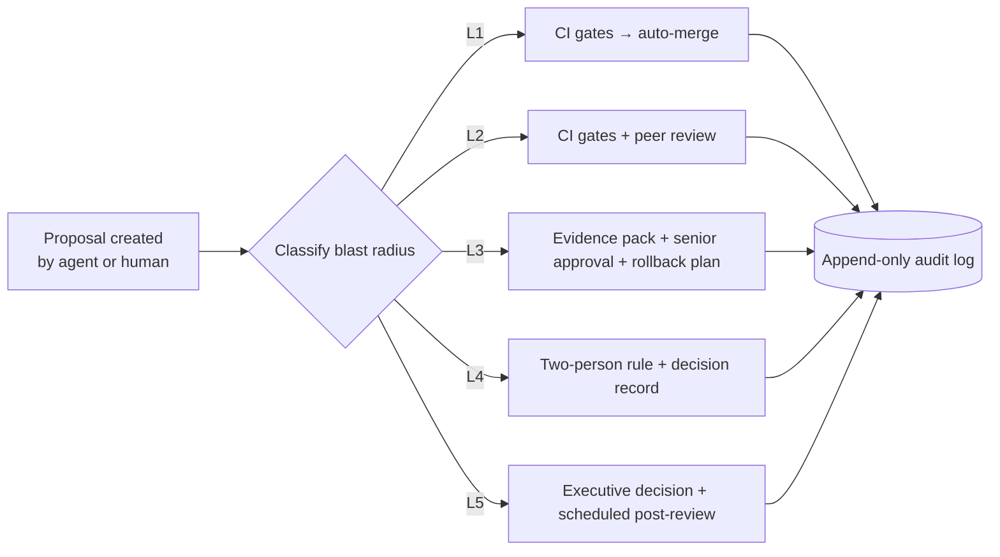

# The L1–L5 AI Review & Escalation Model

> The central governance artifact of this blueprint. Names and thresholds are illustrative; the *structure* is the pattern.

## Why tiers

"Human in the loop" is meaningless until you specify **which human, for what, with which evidence, and with what authority**. A single approval step treats a comment typo and a risk-parameter change as equals. They are not. The L1–L5 model assigns every change and every decision a **blast-radius tier**, and each tier defines the maximum autonomy AI is allowed.

## The five levels

| Level | Class of change / decision | Examples | AI autonomy | Human requirement |
|---|---|---|---|---|
| **L1** | Trivial, fully reversible | Docs, comments, test additions, lint fixes | **Full** — AI may merge after CI passes | None. Sampled retrospectively in audits |
| **L2** | Standard, reversible, single service | Bug fixes, refactors, dependency patches, new non-critical endpoints | **Conditional** — AI implements, tests, and opens the change | Peer human review + all CI gates green |
| **L3** | Significant, harder to reverse | Schema migrations, new models to staging, config changes with financial effect, SLO changes | **Drafting only** — AI prepares change + evidence pack | Named senior engineer approval; rollback plan mandatory |
| **L4** | Critical, financial/regulatory blast radius | Risk parameters, forecasting model promotion to production, execution logic, access-control changes | **Advisory only** — AI may analyze and recommend, never implement unaided | Two-person rule: domain owner + risk/compliance approver; logged decision record |
| **L5** | Existential / irreversible | Kill-switch actions, capital-affecting strategy changes, incident command decisions, anything touching customer funds | **None** — AI provides situational evidence only | Named accountable executive; full audit record; post-decision review scheduled at creation time |

## Rules that make the model real

### 1. Classification is enforced, not suggested
The change-intake path (PR templates, pipeline metadata, deployment manifests) requires a declared tier. Under-declaring a tier is itself a policy violation surfaced in audit. When classification is ambiguous, the **higher** tier applies — uncertainty escalates, never de-escalates.

### 2. Authority is by name, not by role
Each tier maps to *named individuals* on a maintained roster (with deputies for coverage). "The team approved it" is not an acceptable audit entry; "approved by J. Dupont (L4 domain owner) and M. Keller (risk), 2026-07-14T09:32Z, decision record DR-2026-118" is.

### 3. Evidence packs are generated, not written
For L3+, the system assembles the evidence pack automatically: diff summary, test results, security scan output, blast-radius analysis, rollback procedure, related incidents, and (for model promotions) validation metrics and drift baselines. Humans approve *evidence*, not narratives. This also removes the temptation to approve vibes.

### 4. Overrides are telemetry
Every time a human rejects or modifies an AI recommendation, that is a structured event. Override rate by agent, by domain, and by tier is a first-class governance metric. Rising overrides mean the AI's judgment is drifting from the organization's; falling-to-zero overrides may mean rubber-stamping. Both trigger review.

### 5. Escalation has a clock
L4/L5 items have decision SLAs. An undecided L4 item doesn't silently age — it escalates. A system that can wait forever for a human is a system that will, at the worst possible moment.

### 6. Emergency ≠ exempt
Break-glass procedures exist for incidents, but emergency actions taken at elevated privilege generate a **mandatory retrospective record within 24 hours** and a post-incident review. Urgency changes *when* evidence is produced, never *whether*.

## Failure modes this prevents

- **Rubber-stamping** — evidence packs and override telemetry make approval quality measurable
- **Accountability diffusion** — named authority at every tier; "the AI did it" is never an acceptable root cause
- **Automation creep** — anything attempting to bypass a tier fails closed (see [fail-closed-patterns.md](fail-closed-patterns.md))
- **Audit theater** — the log is written by the pipeline, not reconstructed from memory in Q4

---

**Related:** [human-decision-support.md](human-decision-support.md) · [genai-coding-testing-pipeline.md](genai-coding-testing-pipeline.md) · [adr/0002](../adr/0002-tiered-human-approval.md)
