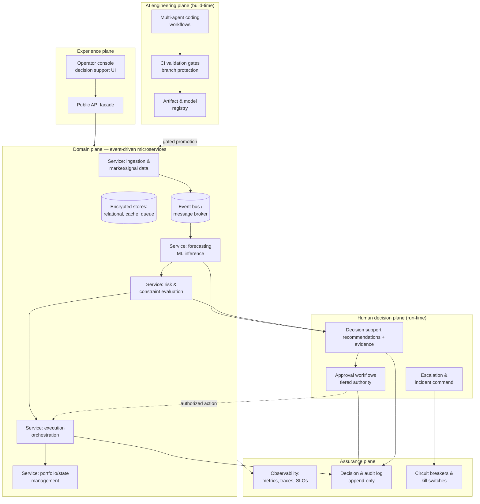

# Architecture Overview (Anonymized)

> All names are fictionalized. Specific vendors, products, and configurations are withheld per [DISCLAIMER.md](../DISCLAIMER.md).

## Design intent

The platform this blueprint is distilled from is an **AI-native, event-driven system operating in a financially sensitive domain**. Its architecture is conventional in shape — that is deliberate. Mission-critical systems should be boring where boredom buys reliability, and novel exactly where novelty buys governance.

The novel parts are the **control plane for AI-generated change** and the **decision-support plane for humans** — not the plumbing.

## High-level view

## Key architectural decisions

### 1. Event-driven core, synchronous guardrails

Services communicate through an event bus for decoupling and replayability — every state change is an event, so the audit trail is a by-product of the architecture rather than a bolt-on. But the **risk evaluation and execution path is deliberately synchronous**: no order, deployment, or parameter change proceeds until constraints are checked and, where required, human approval is recorded. Async everywhere is a latency story; sync at the guardrail is a safety story.

### 2. Four planes, not one stack

The system is organized as four planes with explicit interfaces:

- **Domain plane** — the business services. Treated as *untrusted output* of the engineering process.
- **AI engineering plane** — where agents generate code, tests, configs, and models. Nothing crosses into the domain plane except through validation gates and the registry.
- **Human decision plane** — where recommendations become decisions. Has its own UI, its own workflows, and its own audit stream.
- **Assurance plane** — observability, audit logging, circuit breakers. Watches all other planes and can halt any of them.

The planes matter because each has a **different trust model and a different owner**. Conflating them is how AI demos become production incidents.

### 3. Registry-mediated promotion

Code artifacts and ML models reach production only via a registry that records: what was promoted, which agent/human produced it, which validations it passed, who approved it, and how to roll it back. Promotion is an *event with evidence*, not a file copy.

### 4. Circuit breakers as first-class services

Kill switches are not runbook entries — they are services with their own SLOs. Any human at the appropriate authority tier (and the assurance plane itself, for defined invariants) can halt execution, freeze model promotion, or force the system into read-only mode. Breakers are tested like features: chaos drills verify they actually stop things.

### 5. Observability covers AI behavior, not just infrastructure

Beyond classic RED/USE metrics, the platform tracks agent-level signals: proposal acceptance rates, gate failure rates per agent, model drift metrics, forecast calibration, and override rates (how often humans reject AI recommendations — a rising override rate is a governance signal, not an inconvenience).

## What is deliberately NOT shown

- Real service names, counts, and boundaries
- Broker, database, and registry product choices
- Network topology, cloud regions, deployment configs
- The financial domain logic, risk parameters, and thresholds

See [DISCLAIMER.md](../DISCLAIMER.md).

---

**Related:** [ai-review-escalation-model.md](ai-review-escalation-model.md) · [fail-closed-patterns.md](fail-closed-patterns.md) · [compliance-mapping.md](compliance-mapping.md)
