# GenAI Coding & Testing Pipeline

> How AI-generated code and tests earn production status. Tool names genericized per [DISCLAIMER.md](../DISCLAIMER.md).

## Threat model

AI coding agents are treated as **extremely productive junior engineers with no fear and no accountability**. They produce plausible code at inhuman speed, including plausible *wrong* code. The pipeline is therefore built on one axiom:

> **AI output is a proposal. It becomes a change only by surviving the same evidence requirements as a human change — plus extra gates humans don't need.**

## Pipeline stages

```mermaid
flowchart LR
    SPEC[1 · Specification<br/>human-authored intent] --> PLAN[2 · Agent plan<br/>reviewed before code]
    PLAN --> GEN[3 · Generation<br/>multi-agent, sandboxed]
    GEN --> STATIC[4 · Mechanical gates<br/>lint · types · SAST · secrets]
    STATIC --> TEST[5 · Behavioral gates<br/>unit · contract · property · regression]
    TEST --> REVIEW[6 · Tiered human review<br/>per L1–L5 model]
    REVIEW --> REG[7 · Registry<br/>evidence-attached promotion]
    REG --> DEPLOY[8 · Progressive deploy<br/>canary + auto-rollback]
    DEPLOY --> OBS[9 · Post-deploy watch<br/>SLO guard window]
```

### 1 · Specification-driven development
Agents never start from a vague ticket. Every unit of work begins with a structured spec: intent, acceptance criteria, constraints ("must not touch module X"), risk notes, and declared L-tier. Poor specs are rejected before generation — the cheapest defect is the one never written.

### 2 · Plan review before code review
For L2+ work, the agent's *implementation plan* (files touched, approach, test strategy) is reviewed before generation begins. Reviewing a plan costs minutes; reviewing a 40-file diff built on a wrong approach costs hours and tempts rubber-stamping.

### 3 · Sandboxed generation, multi-agent patterns
Generation runs in isolated environments with least-privilege credentials — no production access, no secrets beyond what the task needs, network egress restricted. A separate agent (or a different model/family) acts as **adversarial reviewer**: its job is to find defects, security issues, and spec deviations in the generator's output before any human sees it. Generator and critic never share context beyond the artifact itself, to avoid correlated blind spots.

### 4 · Mechanical gates (no human time spent on machine-checkable things)
- Lint and formatting — enforced, not advisory
- Static types at strict settings
- SAST (security static analysis) — medium severity and above fails the gate
- **Secret scanning** — any credential-shaped string fails the build
- Dependency/license scanning with an allowlist
- IaC validation (`validate`, `fmt`, policy-as-code checks) for infrastructure changes

### 5 · Behavioral gates — including AI-written tests under suspicion
AI agents also generate tests, which creates an obvious circularity risk: agent writes code, agent writes tests that pass against that code. Mitigations:

- **Test provenance rule**: acceptance tests derive from the *specification*, not from the implementation. Where possible, spec-derived tests are generated by a different agent than the implementation.
- **Mutation testing on critical paths**: the suite must kill injected mutants; a test suite that passes against deliberately broken code is worse than no suite.
- **Property-based testing** for financial invariants (conservation of value, idempotency, ordering guarantees) — invariants are human-authored, not agent-invented.
- **Regression corpus**: every historical production incident contributes at least one regression test, permanently.

### 6 · Tiered human review
Nothing here replaces the [L1–L5 model](ai-review-escalation-model.md); the pipeline *feeds* it. The review tier is declared in the spec, stamped into the PR metadata, and enforced by branch protection: L3+ merges are technically impossible without the recorded approvals.

### 7 · Registry promotion with evidence
Merged artifacts enter the registry with their full evidence pack attached: spec, plan, gate results, critic report, approvals, rollback procedure. Rollback is always one registry operation, rehearsed.

### 8 · Progressive deployment
Canary first, SLO-guarded: error rate, latency, and domain invariants are watched against baseline for a defined window; breach triggers automatic rollback *and* an L-tier escalation. "Deployed" and "validated in production" are different states.

## Metrics that keep the pipeline honest

| Metric | Healthy direction | What it catches |
|---|---|---|
| Gate failure rate per agent | Stable or falling | An agent drifting in quality |
| Human override rate on AI proposals | Mid-band | Both rubber-stamping (~0%) and distrust (high) |
| Escaped-defect rate per tier | Falling | Whether tiers are classified honestly |
| Time in review by tier | Within SLA | Review bottlenecks that create pressure to merge anyway |
| Rollback rehearsal success | 100% | Whether "reversible" is true or decorative |

## Anti-patterns this design rejects

- ❌ "The AI reviewed it" counting as human review
- ❌ Tests accepted from the same context that wrote the implementation, unchallenged
- ❌ Velocity metrics that reward merged volume (you get what you measure: volume)
- ❌ A single super-prompt agent with production credentials

---

**Related:** [ai-review-escalation-model.md](ai-review-escalation-model.md) · [fail-closed-patterns.md](fail-closed-patterns.md) · [adr/0001](../adr/0001-fail-closed-configuration.md)
