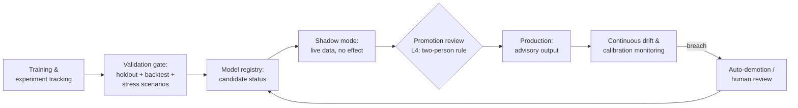

# ML Forecasting Governance

> How forecasting models are validated, promoted, monitored, and — above all — kept in an advisory role. Algorithms and thresholds withheld per [DISCLAIMER.md](../DISCLAIMER.md).

## The governing principle

> **A forecast is evidence for a human decision. It is never the decision.**

In a financially sensitive system, a model that acts autonomously is not an asset; it is an unindicted co-conspirator. This platform's models forecast, rank, and recommend. Humans — at the tier appropriate to the blast radius — commit.

## Lifecycle with gates

### 1 · Validation gate (before anything live)
- Holdout evaluation against frozen datasets — no training-time leakage
- Backtesting across regime diversity, including historical stress periods; a model that only knows calm markets is a liability with good metrics
- Calibration analysis: when the model says 70%, it should be right ~70% of the time. An accurate-but-miscalibrated model corrupts every downstream decision
- Documented intended use, known limitations, and forbidden uses — attached to the model version in the registry

### 2 · Shadow mode
Candidate models run against live data with **zero effect** on decisions for a defined period. Shadow output is scored against what the production model (or human baseline) did, and against realized outcomes. Promotion without shadow evidence does not happen, however good the backtest looks.

### 3 · Gated promotion — L4 by default
Model promotion to production is an L4 decision: evidence pack auto-assembled (validation metrics, shadow results, drift baseline, rollback to previous version), approved by the domain owner *and* a risk/compliance approver, recorded as a decision record. The pipeline technically enforces this — a model cannot become production-visible without the recorded approvals.

### 4 · Continuous monitoring in production
- **Data drift** — input distributions vs. training baseline
- **Prediction drift** — output distribution shifts
- **Calibration drift** — realized outcomes vs. predicted probabilities
- **Override telemetry** — how often humans deviate from the model's recommendation, and whether the human or the model was right in hindsight

Breaches don't page a generic on-call; they create a governance item: auto-demotion to shadow or advisory-degraded mode, plus a human review task with a clock.

### 5 · Human decision support interface
Forecasts reach humans as a **decision pack**, not a number: the prediction, its confidence/calibration context, the top contributing factors at an explanation level appropriate to the audience, the model's known limitations for this regime, and the relevant historical analogues. The UI is designed so that *disagreeing with the model is a first-class, low-friction, recorded action* — see [human-decision-support.md](human-decision-support.md).

## Hard rules

1. **No autonomous action.** Model outputs cannot trigger execution paths directly; they populate decision-support queues. Constraint checks (risk limits, exposure caps) are enforced by deterministic code outside the model — a model can be wrong, a limit is a limit.
2. **No silent retraining.** Retraining produces a *new candidate* that re-enters the lifecycle at validation. "Same model, refreshed weights" is not a concept that exists here.
3. **Every production inference is logged** with model version, input snapshot reference, output, and downstream human decision — reconstructable end-to-end.
4. **Graceful degradation is fail-closed.** If inputs are stale, features invalid, or drift beyond bounds: the model abstains, the system says so loudly, and humans decide with the degraded-evidence flag visible. An abstaining model is healthy; a guessing model is an incident.

## Metrics

| Metric | Purpose |
|---|---|
| Calibration error over rolling windows | Trustworthiness of confidence |
| Shadow-vs-production divergence | Promotion readiness |
| Override rate + override correctness | Human–model calibration over time |
| Time-to-detection for drift | Monitoring adequacy |
| Promotion cycle time with evidence completeness | Governance that doesn't strangle iteration |

---

**Related:** [human-decision-support.md](human-decision-support.md) · [ai-review-escalation-model.md](ai-review-escalation-model.md) · [adr/0003](../adr/0003-ml-promotion-gates.md)
